# 🌾 Farming Assistant

**Farming Assistant** is a comprehensive web-based agricultural support system that bridges the gap between farmers, customers, and agricultural experts. The platform empowers farmers by offering an online marketplace, access to expert advice, blog sharing, and agricultural news while ensuring transparency and digital growth in rural farming.

---

## ✅ Project Overview

This system addresses core issues in the rural agricultural supply chain such as lack of fair pricing, expert support, and modern farming awareness. Through digitized solutions like online product listings, agricultural blogs, and expert consultations, it allows farmers to scale their reach and increase productivity.

---

## 🚀 Features

### 1. **User Roles and Functionalities**

#### 👨‍🌾 Farmers
- Add, edit, and manage farm product listings
- View and receive product orders
- Post agricultural problems for expert feedback
- Read agricultural blogs and market updates

#### 🧑‍🏫 Agriculturists
- Write and manage blogs
- Provide solutions to farmer-submitted problems

#### 🛒 Customers
- Browse and purchase farm products
- View detailed product information
- Place orders via online marketplace

#### 👨‍💼 Admin
- Manage users (add/remove farmers, customers, agriculturists)
- Approve, edit, or remove products and blogs
- Handle category management
- View system analytics and statistics

---

## 🛠️ Technology Stack

- **Frontend:** HTML, CSS, JavaScript  
- **Backend:** PHP  
- **Database:** MySQL  
- **Server Environment:** XAMPP  
- **Text Editor:** Visual Studio Code  
- **Learning Resources:** MDN Web Docs, W3Schools, Stack Overflow

---

## ⚙️ System Requirements

### ✅ Functional Requirements
- Role-based login system (Admin, Farmer, Customer, Agriculturist)  
- Add, edit, delete product/blog entries  
- Order management system  
- Help/solution board for farmers  
- Blog and article management  
- View agriculture-related articles, weather, and market updates  

### 🔐 Non-Functional Requirements
- User-friendly design and layout  
- Efficient image storage for products and blogs  
- Responsive performance for all user roles  
- Maintainable structure for future updates  

---

## 📘 User Guide

### 🔓 General Features (No Login Required)
- View homepage, latest farm products, articles, and blogs  
- Read agricultural news and government notices  
- Browse product categories and live market pricing  

### 🔐 Role-Based Features (Login Required)
- Farmers: Manage products, view solutions to problems  
- Agriculturists: Post blogs and solve problems  
- Customers: Place orders, view product details  
- Admin: System-wide management of users, products, and categories  

---

## 📄 Project Documentation

- 📘 **SRS (Software Requirements Specification):**  
  [Click to view SRS](https://drive.google.com/file/d/1wupgRyjuSgyax6xJmkJNP0n52c_OdNIW/view?usp=sharing)

- 📑 **Project Report:**  
  [Click to view Project Report](https://drive.google.com/file/d/1wsW_v7lIUElye37hzDu9zdzP22kr8xqS/view?usp=sharing)

- 📊 **Requirement Size & Function Point Documentation:**  
  [Click to view FP & Size Document](https://drive.google.com/file/d/1-8wcajAGnPZetEckW-ke-TouzoI80b3Q/view?usp=sharing)

---

## 📸 Screenshots

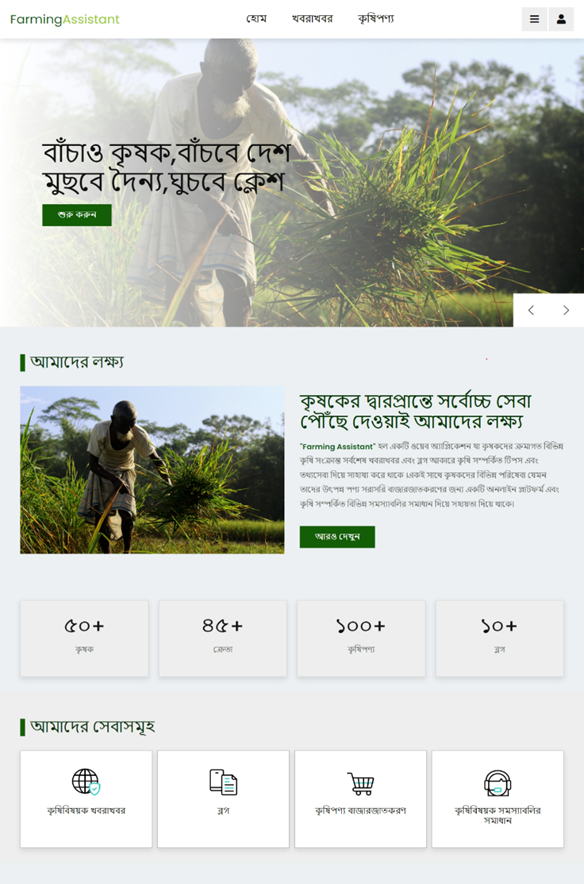  
*Home Page*

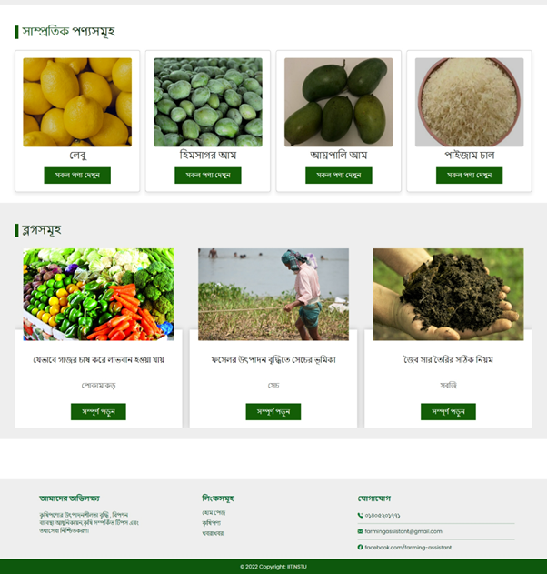  
*Home Page*

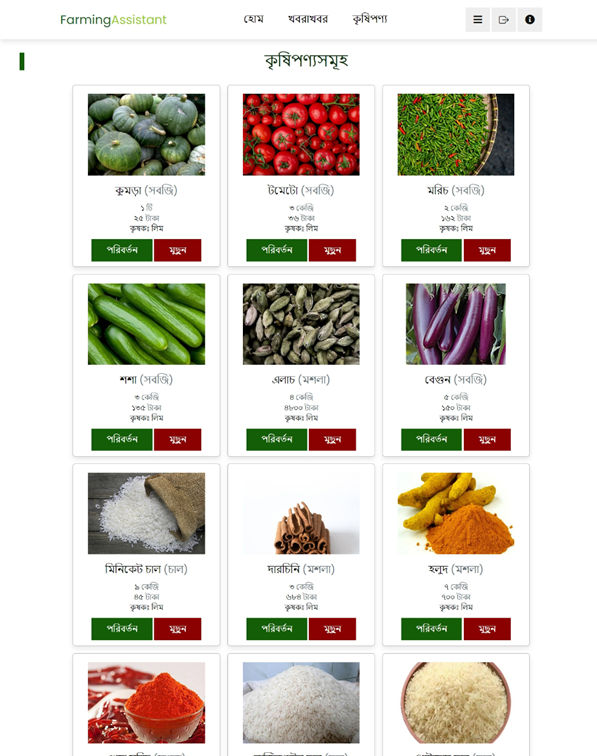  
*Product Details*

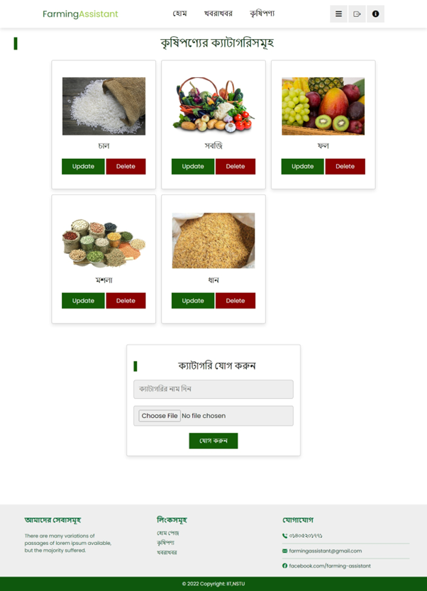  
*Category Details*

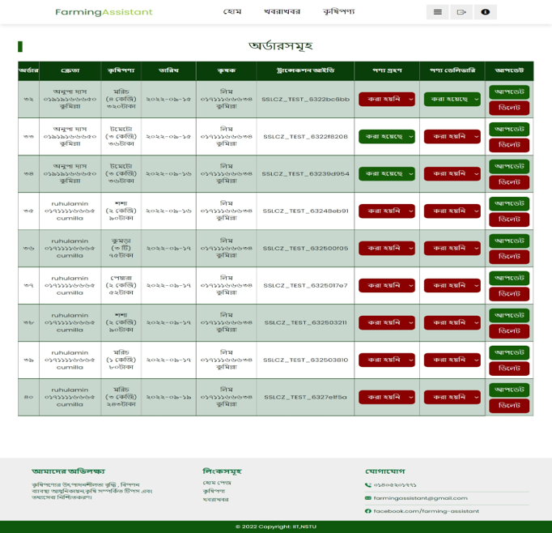  
*Orders List*

  
*Market Price*

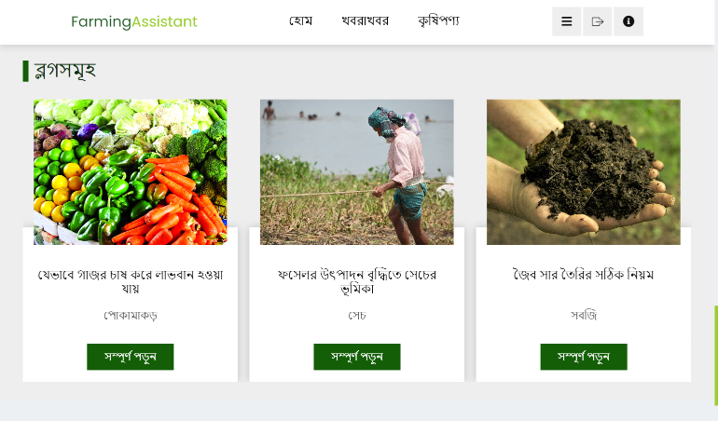  
*Blog Page*

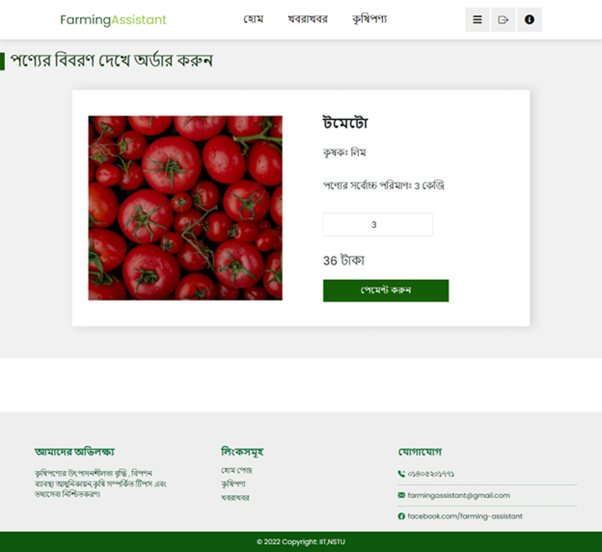  
*Problems Post*

  
*Seek Helps*

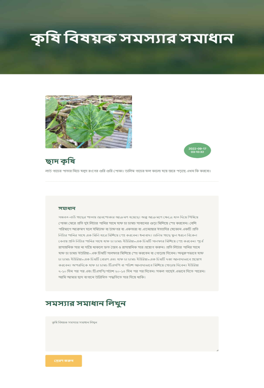  
*Solution Post*

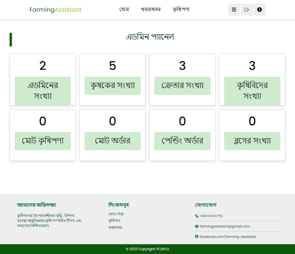  
*Admin Panel*

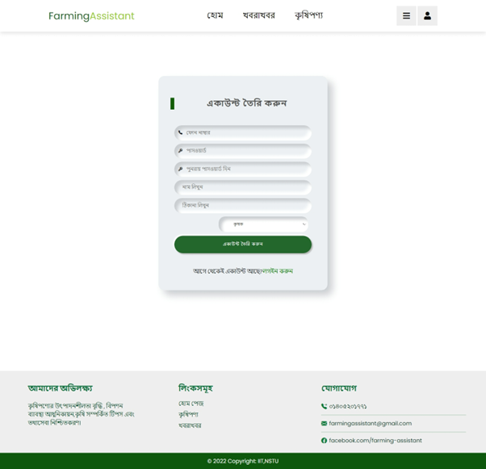  
*Sign Up Page*

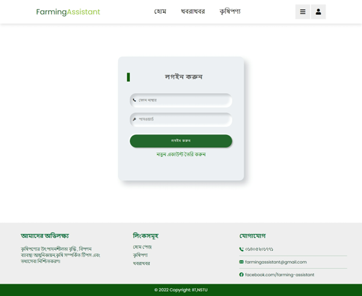  
*Login Page*
---

## 🧑‍🏫 Supervisor

**Name:** Ms. Tasniya Ahmed  
**Position:** Assistant Professor, Institute of Information Technology  
**Institution:** Noakhali Science and Technology University (NSTU)  
📧 [tasniya.iit@nstu.edu.bd](mailto:tasniya.iit@nstu.edu.bd)

---

## 👨‍💻 Project Members

- **Ishrat Jahan Rintu** — [ishrat2514@student.nstu.edu.bd](mailto:ishrat2514@student.nstu.edu.bd)  
- **Anupa Das Shormi** — [anupa2514@student.nstu.edu.bd](mailto:anupa2514@student.nstu.edu.bd)  
- **Md. Alamgir Hossain** — [alamgir2514@student.nstu.edu.bd](mailto:alamgir2514@student.nstu.edu.bd)

---

## 📬 Contact

**Author for Queries:** Md. Alamgir Hossain  
📧 Email: [alamgir2514@student.nstu.edu.bd](mailto:alamgir2514@student.nstu.edu.bd)  
🔗 GitHub: [@your-username](https://github.com/your-username)  
🔗 LinkedIn: [linkedin.com/in/your-profile](https://linkedin.com/in/your-profile)

---

## 📜 License

This project is for academic and educational use.  
All rights reserved by the authors and supervisor.
